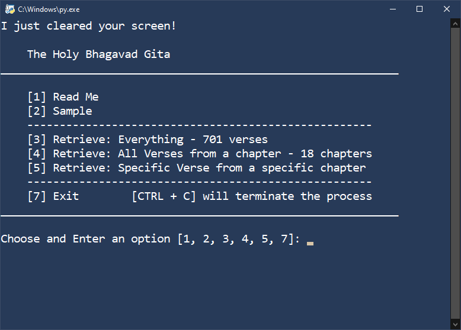
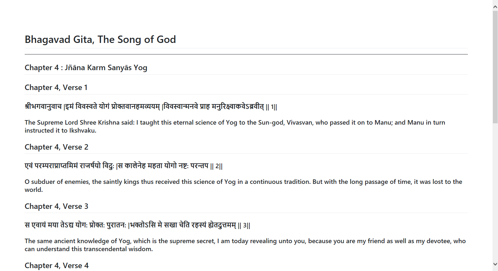
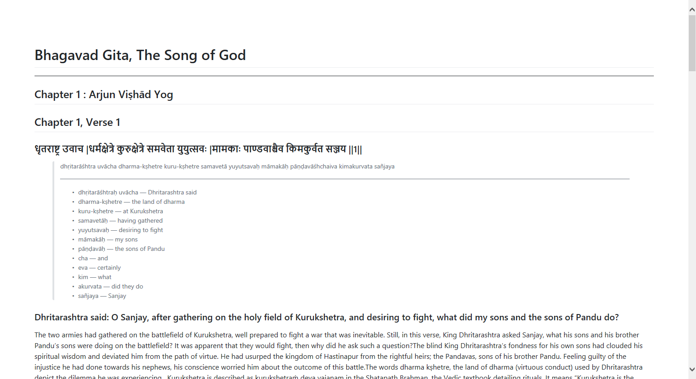
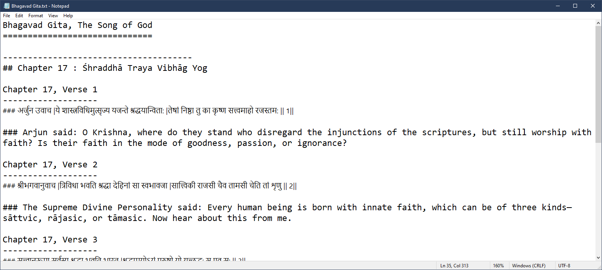
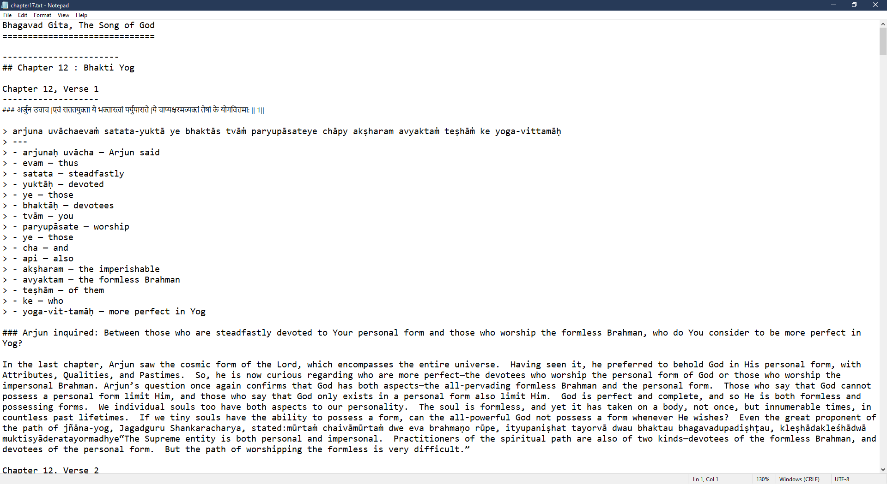

# Bhagavat Gita From Web Scraping

Web Scraping and retrieving different chapters and verse of the Holy Bhagvat Gita.

### Why?
I was bored and wanted to read The Bhagavad Gita.

## Usage

### Install Python 3.6 or higher (Duh!)

*Go to python [Download Page](https://www.python.org/downloads/ "Go to python download page to download the latest version of python.").*

### 1. Install requirements

        pip install -r requirements.txt

- [x] BeautifulSoup4
- [x] Requests
- [ ] ~~lxml~~

### 2. Run `main.py` and follow along

    python3 main.py

## Feature List

- You could choose among different options such as:
    + Retrieve: Everything - All 700 verses
    + Retrieve: A single chapter - All verses from selected chapter
    + Retrieve: Specific verse from a specific chapter
    + Retrieve and print a random quote.
    + And More..
- Choose to save output file in:
    - Markdown (.md) format (Recommended)
    - Or text (.txt) format
- CTRL + C (^C) will terminate and abort the program in any given time
- And more

## What's New

- The re-wrote all code from scratch
- More readable and understandable code then before.
- Moved all the functions to separate file *(myfunctions.py)*
- Menu now is even cleaner and has more options.
- Should work in Linux and OS X *(Not Tested)* as well.
- Your won't ever see an traceback.

## Screen-shots

#### Code in Action

#### Sample output file in Markdown file format

#### Sample output file in Text file format

## What's Coming
- [ ] Add to program Read Me
- [ ] Download Original verse audio

---
\# The End.
